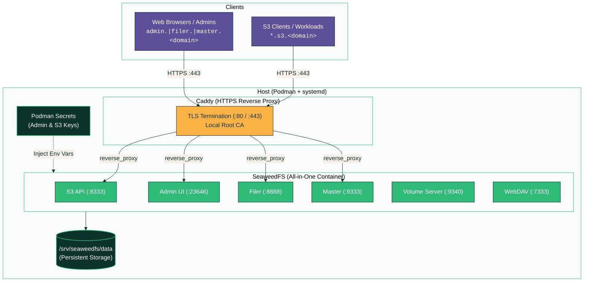

# SeaweedFS & Caddy HTTPS on Podman (systemd quadlet)

Boot-persistent SeaweedFS deployment (S3 API, Master, Volume, Filer, WebDAV,
Admin UI) with a Caddy HTTPS reverse proxy running as root-managed Podman services.

## Architecture



## Files

| File                    | Purpose                                                          |
|-------------------------|------------------------------------------------------------------|
| `seaweedfs.container`   | SeaweedFS Quadlet unit (Podman >= 4.4.0)                         |
| `caddy.container`       | Caddy HTTPS Reverse Proxy Quadlet unit (Podman >= 4.4.0)          |
| `seaweedfs.service`     | SeaweedFS standard systemd unit file (fallback for Podman < 4.4) |
| `caddy.service`         | Caddy standard systemd unit file (fallback for Podman < 4.4)     |
| `Caddyfile`             | Reverse proxy configuration (HTTPS, wildcard S3 bucket routing)  |
| `entrypoint.sh`         | SeaweedFS entrypoint wiring auth & S3 domain name flags          |
| `get-info.sh`           | Summary script displaying all URLs, ports, status & secrets      |
| `setup-ufw.sh`          | Configures UFW firewall rules for Caddy & SeaweedFS ports        |
| `test-s3.sh`            | Automated S3 v4 signature sanity test script                     |
| `install.sh`            | Idempotent setup & update script                                 |
| `uninstall.sh`          | Cleanup script (retains data/secrets/CA unless `--purge` used)   |
| `rotate-credentials.sh` | Credential rotation script                                       |

## Quick Start

```bash
git clone <this-repo> seaweedfs-setup
cd seaweedfs-setup
sudo ./install.sh
```

`install.sh` will:
1. Create persistent storage directories:
   - `/srv/seaweedfs/data` (Volumes and metadata)
   - `/srv/caddy` (Caddy config, PKI & local CA certificates)
2. Install `entrypoint.sh` and `Caddyfile`
3. Generate random Podman secrets for admin UI and S3 credentials (skipped if already existing)
4. Deploy container services (`seaweedfs.service`, `caddy.service`)
5. Print a deployment summary with active endpoints and credentials

## HTTPS Endpoints & DNS Configuration

Caddy automatically manages internal TLS certificates (`tls internal`) for all web and S3 endpoints.

### Required DNS Records

Point the following records to your host server's IP address:

| Record Type | Host / Subdomain | Backend Target | Purpose |
|-------------|------------------|----------------|---------|
| `A` / `CNAME` | `s3.<domain>` | `localhost:8333` | S3 API endpoint |
| `A` / `CNAME` | `*.s3.<domain>` | `localhost:8333` | **Wildcard bucket routing** (e.g. `rancher-backup.s3.<domain>`) |
| `A` / `CNAME` | `admin.<domain>` | `localhost:23646` | SeaweedFS Admin Web UI |
| `A` / `CNAME` | `filer.<domain>` | `localhost:8888` | Filer Web UI / Browser |
| `A` / `CNAME` | `master.<domain>` | `localhost:9333` | Master Cluster UI |

> **Tip**: A single wildcard DNS entry `*.<domain>` pointing to the host IP will cover all endpoints and dynamic buckets.

### Trusting Caddy's Local Root CA

Clients connecting via HTTPS can trust Caddy's auto-generated local root CA certificate:
```text
/srv/caddy/data/caddy/pki/authorities/local/root.crt
```
*(Alternatively, S3 clients on internal networks can be configured to disable TLS verification).*

### Local Testing (`/etc/hosts`)

For testing without a dedicated DNS server, map your host IP on the client machine:

```text
<HOST_IP>  s3.eati-hv-bk-sv.ati.gov.et rancher-backup.s3.eati-hv-bk-sv.ati.gov.et admin.eati-hv-bk-sv.ati.gov.et filer.eati-hv-bk-sv.ati.gov.et master.eati-hv-bk-sv.ati.gov.et
```

### Changing the Domain Name

To deploy with a different base domain (e.g. `storage.example.com`):

1. **Update `Caddyfile`** with your new domain.
2. **Update `Environment=S3_DOMAIN_NAME=s3.storage.example.com`** in `seaweedfs.container` (and `seaweedfs.service` if using legacy systemd).
3. **Update `DOMAIN="storage.example.com"`** in `get-info.sh` and `test-s3.sh`.
4. **Apply changes**:
   ```bash
   sudo ./install.sh --update
   ```

## Ports

| Port  | Service                        | Access | Description |
|-------|--------------------------------|--------|-------------|
| 80    | HTTP                           | Caddy  | Automatically redirects to HTTPS |
| 443   | HTTPS                          | Caddy  | Reverse proxy entrypoint for all services |
| 8333  | S3 API                         | Direct | Direct HTTP fallback |
| 9333  | Master UI                      | Direct | Master status and topology |
| 9340  | Volume Server                  | Direct | Internal volume gRPC/HTTP |
| 8888  | Filer UI                       | Direct | File hierarchy browser |
| 7333  | WebDAV                         | Direct | WebDAV interface |
| 23646 | Admin UI                       | Direct | SeaweedFS administration console |

## Credentials & Secrets

Admin credentials and S3 access/secret keys are generated as random strings and stored as **Podman secrets** (`seaweedfs-admin-user`, `seaweedfs-admin-pass`, `seaweedfs-s3-key`, `seaweedfs-s3-secret`).

To view current credentials at any time:
```bash
sudo ./get-info.sh
```

*(You can also inspect individual secrets on Podman 4.2+ using `sudo podman secret inspect <name> --showsecret`).*

## Operations & Maintenance

### Deployment Status & Secrets Summary

```bash
sudo ./get-info.sh
```

### Service Management & Logs

```bash
# Service status
systemctl status seaweedfs.service caddy.service

# Live logs
journalctl -u seaweedfs.service -u caddy.service -f

# Restart services
sudo systemctl restart seaweedfs.service caddy.service
```

### Credential Rotation

Rotate generated passwords or S3 access keys without data loss:

```bash
sudo ./rotate-credentials.sh             # Rotates all credentials
sudo ./rotate-credentials.sh --admin-pass  # Rotates only Admin UI password
sudo ./rotate-credentials.sh --s3-secret   # Rotates only S3 secret key
```

### Automated Testing & Health Checks

```bash
# Automated S3 AWS SigV4 end-to-end sanity check
sudo ./test-s3.sh

# Cluster master health endpoint
curl -fsSL http://localhost:9333/cluster/status | jq .
```

### Updating Configuration & Units

To apply changes to scripts, units, or Caddy configuration without losing secrets, stored data, or certificates:

```bash
sudo ./install.sh --update
```

### Firewall Configuration (UFW)

Restricts external traffic to HTTPS (`443`) and HTTP (`80`) while keeping internal ports protected:

```bash
sudo ./setup-ufw.sh
```

## Uninstallation

To remove the containers and systemd services while **PRESERVING** storage data, secrets, and Caddy root CA certs:

```bash
sudo ./uninstall.sh
```

To perform a complete removal, **PERMANENTLY PURGING ALL DATA, SECRETS, AND ROOT CA CERTS**:

```bash
sudo ./uninstall.sh --purge
```

*(Pass `-y` / `--yes` for non-interactive scripts).*

## License

This project is licensed under the MIT License - see the [LICENSE](LICENSE) file for details.
