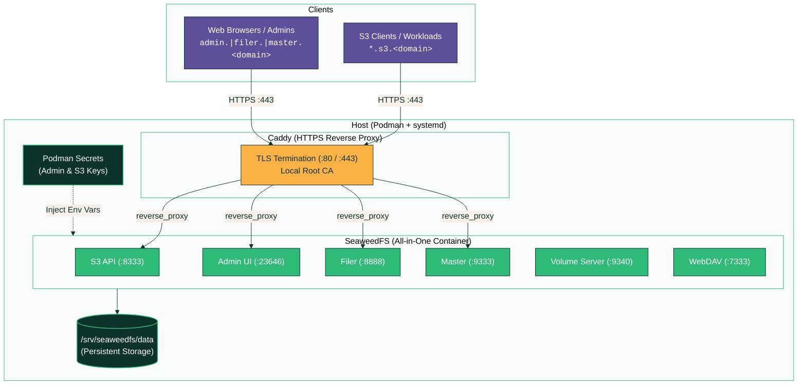

# SeaweedFS & Caddy HTTPS on Podman (systemd quadlet)

Boot-persistent SeaweedFS deployment (S3 API, Master, Volume, Filer, WebDAV,
Admin UI) with a Caddy HTTPS reverse proxy running as root-managed Podman services.

## Architecture



## Files

| File                    | Purpose                                                          |
|-------------------------|------------------------------------------------------------------|
| `seaweedfs.container`   | SeaweedFS Quadlet unit (Podman >= 4.4.0)                         |
| `caddy.container`       | Caddy HTTPS Reverse Proxy Quadlet unit (Podman >= 4.4.0)          |
| `seaweedfs.service`     | SeaweedFS standard systemd unit file (fallback for Podman < 4.4) |
| `caddy.service`         | Caddy standard systemd unit file (fallback for Podman < 4.4)     |
| `Caddyfile`             | Reverse proxy configuration (HTTPS, wildcard S3 bucket routing)  |
| `entrypoint.sh`         | SeaweedFS entrypoint wiring auth & S3 domain name flags          |
| `get-info.sh`           | Summary script displaying all URLs, ports, status & secrets      |
| `setup-ufw.sh`          | Configures UFW firewall rules for Caddy & SeaweedFS ports        |
| `test-s3.sh`            | Automated S3 v4 signature sanity test script                     |
| `install.sh`            | Idempotent setup & update script                                 |
| `uninstall.sh`          | Cleanup script (retains data/secrets/CA unless `--purge` used)   |
| `rotate-credentials.sh` | Credential rotation script                                       |

## Quick start

```bash
git clone <this-repo> seaweedfs-setup
cd seaweedfs-setup
sudo ./install.sh
```

`install.sh` will:
1. Create `/srv/seaweedfs/data` and `/srv/caddy`
2. Install `entrypoint.sh` and `Caddyfile`
3. Generate Podman secrets for admin UI and S3 credentials (skipped if existing)
4. Deploy `seaweedfs-net` network, `seaweedfs.service`, and `caddy.service`
5. Print active HTTPS endpoints and credential summary

## Updating the Installation

To update unit files, scripts, or Caddy configuration without losing secrets, storage data, or local CA certificates:

```bash
sudo ./install.sh --update
```

## HTTPS & Caddy Setup

Caddy serves reverse-proxied HTTPS endpoints using automatically generated local CA certificates (`tls internal`):

- **S3 Endpoint & Buckets**: `https://s3.eati-hv-bk-sv.ati.gov.et` and wildcard buckets like `https://rancher-backup.s3.eati-hv-bk-sv.ati.gov.et`
- **Admin UI**: `https://admin.eati-hv-bk-sv.ati.gov.et`
- **Filer UI**: `https://filer.eati-hv-bk-sv.ati.gov.et`
- **Master UI**: `https://master.eati-hv-bk-sv.ati.gov.et`

### Trusting Caddy's Local Root CA

Clients connecting to HTTPS can trust Caddy's local root CA certificate found on the host at:
`/srv/caddy/data/caddy/pki/authorities/local/root.crt`

*(Alternatively, S3 clients on internal networks can be configured to disable TLS verification).*

## Ports

| Port  | Service                        | Access |
|-------|--------------------------------|--------|
| 80    | HTTP (redirects to HTTPS)      | Caddy  |
| 443   | HTTPS Reverse Proxy            | Caddy  |
| 8333  | S3 API (Direct HTTP fallback)  | Direct |
| 9333  | Master UI (Direct HTTP)        | Direct |
| 9340  | Volume server (gRPC/HTTP)      | Direct |
| 8888  | Filer UI (Direct HTTP)         | Direct |
| 7333  | WebDAV (Direct HTTP)           | Direct |
| 23646 | Admin UI (Direct HTTP)         | Direct |

## Credentials

Admin UI and S3 access/secret keys are generated as random strings during `install.sh` and stored as **Podman secrets**.

Retrieve them any time:

On **Podman >= 4.2**:
```bash
sudo podman secret inspect seaweedfs-admin-user --showsecret
sudo podman secret inspect seaweedfs-admin-pass --showsecret
sudo podman secret inspect seaweedfs-s3-key --showsecret
sudo podman secret inspect seaweedfs-s3-secret --showsecret
```

On **Podman < 4.2** (e.g. Podman 3.4):
```bash
sudo jq -r 'to_entries[] | "\(.key): \(.value | @base64d)"' /var/lib/containers/storage/secrets/filedriver/secretsdata.json
```

To rotate credentials automatically:

```bash
sudo ./rotate-credentials.sh             # rotates all generated credentials
sudo ./rotate-credentials.sh --admin-pass  # rotates only Admin UI password
sudo ./rotate-credentials.sh --s3-secret   # rotates only S3 secret key
```

## Data Persistence & Certificate Retention

- **Storage Data**: `/srv/seaweedfs/data`
- **Caddy Config & Root CA**: `/srv/caddy`

## Operations

```bash
sudo ./get-info.sh                          # Displays all URLs, ports, service status, & secrets
systemctl status seaweedfs.service caddy.service
journalctl -u seaweedfs.service -f
journalctl -u caddy.service -f
sudo systemctl restart seaweedfs.service caddy.service
```

## Uninstallation

To remove the services while **PRESERVING** secrets, storage data, and Caddy root CA certs:

```bash
sudo ./uninstall.sh
```

To remove everything including **PERMANENTLY DELETING ALL PERSISTENT DATA, SECRETS, AND CADDY ROOT CA**:

```bash
sudo ./uninstall.sh --purge
```

For non-interactive or automated scripts, pass `-y` / `--yes` to skip prompts:

```bash
sudo ./uninstall.sh --purge -y
```

## License

This project is licensed under the MIT License - see the [LICENSE](LICENSE) file for details.

